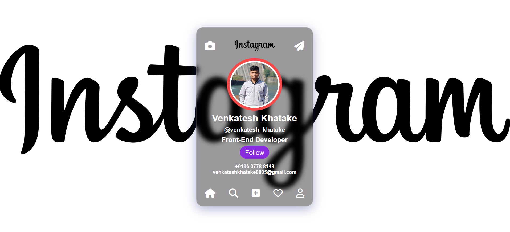

# 👤 Profile Card

This is a simple and responsive **Profile Card** built using HTML and CSS. It showcases a user’s photo, name, title, and contact button along with social media icons.

## 📌 Features

- Responsive design
- Profile picture with rounded styling
- Name and profession
- Social media icons
- "Contact Me" button
- Clean and modern UI

## 🚀 Demo

👉 [Live Demo](https://venkatesh-khatake.github.io/profile-card/)

## 🛠️ Technologies Used

- HTML5
- CSS3
- Google Fonts (optional)
- Font Awesome or other icon library (if used)

## 📸 Screenshot

 <!-- You can upload your own screenshot and name it 'screenshot.png' -->

## 📂 How to Use

1. Clone the repository:
   ```bash
   git clone https://github.com/venkatesh-khatake/profile-card.git
